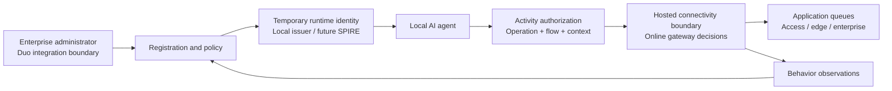

# PMBU Hackfest: agent identity driven traffic prioritization

A dependency-free Node.js prototype for HF-2834. Run on a laptop, Mac mini, or Raspberry Pi with Node 20+. Four profiles (recipe, travel, health, security) receive temporary runtime identities and activity-specific importance. The local hosted-connectivity stand-in authorizes flows and orders an application queue.

## Identity / Duo / RAR foundation (October 6 update)

The new foundation runs separately on port 4191 with simulated Duo approval, policy-controlled RFC 9396 `authorization_details`, signed JWT entitlements, JWKS and online introspection. Start with the [manual walkthrough](docs/MANUAL-TESTING.md), then see [setup, curl commands, schemas and SPIRE profile](docs/FOUNDATION.md). Native flows, both Docker-hosted HTTP demos, the live SPIRE JWT-SVID-to-RAR flow, and all 29 tests passed. Token-free live evidence is in `artifacts/spire-results.json`. Real Duo and ISE integration are out of scope; PCF integration and real network enforcement remain pending. The original prototype below retains its port 4180 behavior.

## Run

```sh
cd /Users/arindamg/Cloud_Security/pmbu-agent-identity
npm test
npm start
```

Open http://127.0.0.1:4180. Copy `adminKey` from `data/state.json` into the dashboard's password field and click **Connect**, then **Run scenario**. No install step or external credentials are needed. The server remains on loopback. Stop with Ctrl+C. `PORT` and `PMBU_DATA_DIR` are optional environment variables.

In a second terminal:

```sh
cd /Users/arindamg/Cloud_Security/pmbu-agent-identity
npm run demo
```

The CLI uses the public HTTP endpoints with distinct administrator, enrollment, workload, and gateway credentials. It runs access, edge, and enterprise scenarios and writes token-free evidence to `artifacts/demo-results.json`. The dashboard's one-click scenario uses the same core methods in-process. Each run creates new demo agents; it does not reset policy or erase prior inventory.

## What is working

- Administrator-controlled registration, profiles and accountable owner/device association.
- Single-use bootstrap credential, valid for five minutes.
- Signed Ed25519 JWT runtime identity, valid for up to ten minutes; renewal and explicit termination.
- SPIFFE-shaped instance ID: `spiffe://pmbu.demo/agents/<agent-id>/instances/<session-id>`.
- Activity grant, valid for up to two minutes, scoped to operation, flow ID, network context and parent identity.
- Current policy evaluation on each gateway request. Old grants do not freeze policy.
- Immediate agent suspension/revocation and activity termination at this online gateway.
- Real in-process application queue ordering, critical before interactive before background; FIFO within each class.
- Monitoring feedback and credential-free audit records. Feedback is an observation, not proof of agent compromise.
- File-backed state and issuer keys survive restart. Dashboard for registration, issuance, lifecycle, policy and demo results.

## Demonstration

| Arrival | Profile | Activity | Default class | Dispatch |
|---|---|---|---|---|
| 1 | Recipe | Recipe fetch | Background | 3 |
| 2 | Health | Model update | Background | 4 |
| 3 | Travel | Booking | Interactive | 2 |
| 4 | Health | Synthetic health alert | Critical | 1 |
| 5 | Security | Security alert | Critical | Denied after agent revocation |

The health update and alert share the same authenticated runtime identity. A recipe agent's request for `health_alert` is denied; a grant cannot be used for another flow. The network context is grant-scoped, and all three contexts currently use the same local class-to-queue mapping.

## Architecture



See [API contract](docs/API.md), [integration boundaries](docs/INTEGRATIONS.md), and [submission / recording script](docs/SUBMISSION.md).

For team collaboration, use the [editable two-page architecture](docs/architecture/pmbu-agent-architecture.drawio) and [lab mapping notes](docs/architecture/README.md). The PNG/SVG exports in that directory show both the team architecture and the proposed integration with the teammate's supplied cellular lab.

## Limits of the prototype

This is **not a SPIRE deployment or a conforming SPIFFE SVID issuer**. It uses ordinary signed JWTs with SPIFFE-shaped subjects. Real SPIRE workload attestation and trust bundles are not implemented. Registration/device association is asserted by an authenticated administrator; the single-use credential stands in for attestation.

There are **no live Duo calls**. The local enterprise-policy model is an integration boundary, not an invented Duo workload-identity API. Duo's documented Auth API handles user MFA; the production administrator or owner approval flow can use that interface after selecting the team's actual enterprise identity integration.

DSCP values are illustrative **intent**: background 8, interactive 0, critical 46. No packet headers, Linux `tc`, switch queues, carrier bearers, 5QI, QFI or QoS flows are configured. Different contexts currently select the same scheduler implementation; their deployment-specific adapters are future work. This demo demonstrates authorization and queue ordering, not cellular performance or clinical alert reliability.

Tokens are bearer credentials and replayable on their permitted flow until expiry. The demo does not prove possession, validate observed packet tuples, attest that a claimed alert is genuine, or apply per-agent rate limits. A compromised health agent can invoke its authorized alert operation. Real deployment must bind workload identity to the observed connection, use TLS/mTLS, and enforce rate/volume budgets. Expired records remain in inventory; the local JSON store, capped audit and synchronous writes are intended for a small hackfest demo rather than scale or high availability. Signing keys and local role secrets are in one mode-0600 file under a mode-0700 directory; move these into appropriate separate stores for deployment. Do not share `data/` or record token panels.

Twenty tests cover issuance, expiry, renewal, tampering, scope, policy changes, lifecycle, persistence, scheduler ordering, all three contexts, and role-separated HTTP authorization. Run `npm test` to verify the current checkout.

## Sources

- [SPIFFE concepts](https://spiffe.io/docs/latest/spiffe/concepts/): identity and verifiable identity documents.
- [JWT-SVID specification](https://spiffe.io/docs/latest/spiffe-specs/jwt-svid/): the real profile to use for a future SPIRE integration.
- [SPIRE concepts](https://spiffe.io/docs/latest/spire-about/spire-concepts/): node/workload attestation and registration selectors.
- [Cisco Duo Auth API](https://duo.com/docs/authapi): documented user MFA interface.
